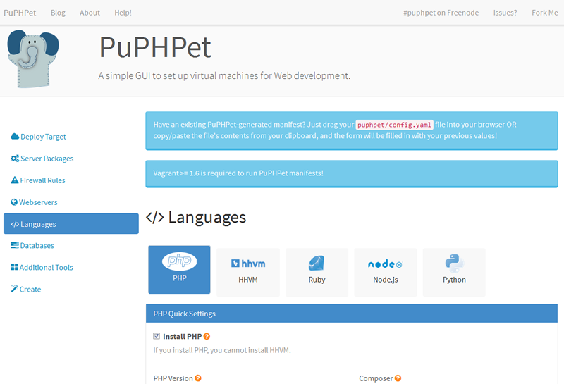
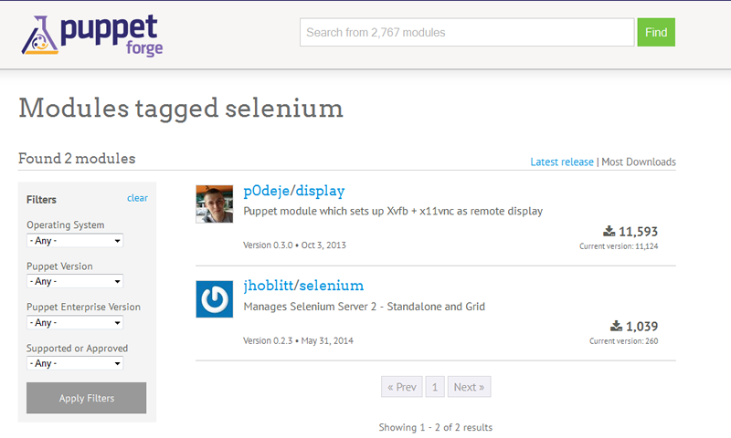
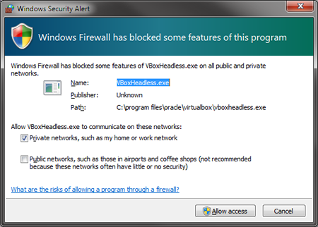

class: center, middle

background-image: url(images/crowd.jpg)


# Vagrant & Puppet
## Tips & Tricks

---
class: table-list, center

--

* 
* 
* 
--

* 
* 
--

* 
--

* 
* 
--

* 
* 
--

* 
* 
--

* 
--

* 
--

* 

--

#Why we use Vagrant & Puppet

---
class: center
#Overview
.left[
* Vagrant - CLI for virtual machines
* Puppet - Configuration & software management
]
.left[
* Vagrantfile
* Manifests & Modules
* Version control your development environment
]
---
class: center, middle
background-image: url(images/puphpet.png)

# Getting Started

##Using PuPHPet
---



---
class: center, middle
#Customising

Let's install selenium RC in our VM
---



---

Puppetfile :
```coffeescript
mod 'jhoblitt/selenium'
	mod 'rodjek/logrotate' #Dependency for selenium
```

default.pp:
```ruby
class { 'selenium::server':
  display      => ':99',
}
```

```c#
C:\Users\Doug\Code\vagrant>vagrant provision
```
---
class: center, middle
#YAML
1 minute SSL VHost

---

```coffeescript
apache:
    vhosts:
        "%{::vm_hostname}": &ents24
            servername: "%{::vm_hostname}"
            serveraliases:
                - "%{::host_hostname}.local.ents24.com"
            docroot: /var/www/
            port: '80'
            directories:
                - path: /var/www/
                  allow_override: all
                - path: /var/www/ents24/Web/
                  fallbackresource: /ents24/Web/index.php
            request_headers:
                - set Served-As "HTTP"
```
--

```coffeescript
        #This SSL vhost is a reference to the one above,
		#and overrides some settings
        "%{::vm_hostname}-ssl":
            <<: *ents24
            ssl: true
            port: 443
            ssl_cert: '/etc/ssl/ents24/ents24-dev.crt'
            ssl_key: '/etc/ssl/ents24/ents24-dev.key'
            request_headers:
                - set Served-As "HTTPS"
```
---

```coffeescript
apache:
    vhosts:
*        "%{::vm_hostname}": &ents24
            servername: "%{::vm_hostname}"
            serveraliases:
                - "%{::host_hostname}.local.ents24.com"
            docroot: /var/www/
            port: '80'
            directories:
                - path: /var/www/
                  allow_override: all
                - path: /var/www/ents24/Web/
                  fallbackresource: /ents24/Web/index.php
            request_headers:
                - set Served-As "HTTP"
```
```coffeescript
        #This SSL vhost is a reference to the one above,
		#and overrides some settings
        "%{::vm_hostname}-ssl":
*            <<: *ents24
            ssl: true
            port: 443
            ssl_cert: '/etc/ssl/ents24/ents24-dev.crt'
            ssl_key: '/etc/ssl/ents24/ents24-dev.key'
            request_headers:
                - set Served-As "HTTPS"
```
---
#Shared Folder Speed

Virtualbox is slow (allegedly).

* NFS (Linux / OSX)
	* Requres root

* Samba (Windows)
	* Requires administrator privileges 
	* Creates new share every time you boot!

* VMWare
	* Costs money!
	* Both software & vagrant plugin required

---
class: center, middle
#Port Forwarding

---
#Windows

```ruby
  host_port     = Vagrant::Util::Platform.windows? ? 80  : 8080
  host_port_ssl = Vagrant::Util::Platform.windows? ? 443 : 8443

  config.vm.network "forwarded_port", guest: 80,  host: host_port
  config.vm.network "forwarded_port", guest: 443, host: host_port_ssl
```

.center[

]

---
#Linux (rinetd)

```
sudo apt-get install rinetd
```

/etc/rinetd.conf:
```
# bindadress bindport connectaddress connectport
0.0.0.0 80 127.0.0.1 8080
0.0.0.0 443 127.0.0.1 8443
```

---
#OSX (pf)

Anchor File:
```
rdr pass on lo0 inet proto tcp 
	from any to 127.0.0.2 port 80 -> 127.0.0.1 port 8080
```

PF Config:
```
rdr-anchor "forwarding"
load anchor "forwarding" from "/etc/pf.anchors/<anchor file>"
```

Sysctl :
```
net.inet.ip.forwarding=1
net.inet6.ip6.forwarding=1
```

Launch list :
```
<key>ProgramArguments</key>
<array>
	<string>pfctl -e -f /etc/pf.conf</string>
	<string>-e</string>
	<string>-f</string>
	<string>/etc/pf.conf</string>
</array>
```

---
class: center, middle
#Golden Master

---
#Puppet is Idempotent

.center[

]

You can apply a puppet manifest to the same system as many times as you want!

```
C:\Users\Doug\Code\vagrant>vagrant provision
C:\Users\Doug\Code\vagrant>vagrant provision
C:\Users\Doug\Code\vagrant>vagrant provision
C:\Users\Doug\Code\vagrant>vagrant provision
```
---
#Packaging

Vagrantfile :
```
config.vm.box     = "debian-wheezy72-x64-vbox43"
config.vm.box_url = "http://share/vagrant/debian-wheezy72-x64-vbox43.box"
```

```
C:\Users\Doug\Code\vagrant>vagrant provision
...
20 minutes later
...
C:\Users\Doug\Code\vagrant>vagrant package --output ents24-base-2014-10-07
```

```
config.vm.box     = "ents24-base-2014-10-07"
config.vm.box_url = "http://share/vagrant/ents24-base-2014-10-07.box"
```

Takes 2 minutes:
```
C:\Users\Doug\Code\vagrant>vagrant provision
```

???

Rinse, Repeat
---
class: center, middle

#Questions?